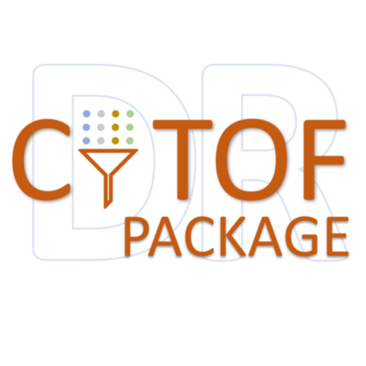

CytofDR: CyTOF Dimension Reduction Framework
=======================================================================

CytofDR is a framework of dimension reduction (DR) and its evaluation for both
Cytometry by Time-of-Flight (CyTOF) and general-purpose usages. It allows you to
conveniently run many different DRs at one place and then evaluate them to pick
your embedding using our extensive evaluation framework!

Why wait? Try this example below and start your DR journey:

.. code-block:: python

    >>> import numpy as np
    >>> from CytofDR import dr
    >>> expression = np.loadtxt(fname="PATH_To_Expression_Matrix", dtype=float, skiprows=1, delimiter=",")
    >>> results = dr.run_dr_methods(methods = ["UMAP", "open_tsne"])
    >>> results.evaluate(category = ["global", "local", "downstream"])
    >>> results.rank_dr_methods()

.. toctree::
   :maxdepth: 1
   :caption: Getting Started

   installation
   quickstart

.. toctree::
   :maxdepth: 1
   :caption: Tutorial

   tutorial/preprocessing
   tutorial/methods
   tutorial/method_choice
   tutorial/metrics
   tutorial/custom
   tutorial/save_results
   tutorial/optimizations

.. toctree::
   :maxdepth: 1
   :caption: Development

   change/contribution
   change/build
   change/development
   change/index
   license

.. toctree::
   :maxdepth: 1
   :caption: Full API Reference

   documentation/index

.. toctree::
   :maxdepth: 1
   :caption: Resources
   :hidden:

   references
   Our Paper <https://doi.org/10.1101/2022.04.26.489549>
   Dr. Xinlei (Shery) Wang <https://people.smu.edu/swang/>
   Dr. Tao Wang <https://qbrc.swmed.edu/labs/wanglab/aboutpi.php>
   DBAI <https://dbai.biohpc.swmed.edu/>
   GitHub <https://github.com/kevin931/CytofDR/>
   
***********************
Resources
***********************

For more resources on our labs, collaborators, and related projects, please visit the following:

   * `Our paper <https://doi.org/10.1101/2022.04.26.489549>`_
   * `Dr. Xinlei (Shery) Wang faculty page <https://people.smu.edu/swang/>`_
   * `Dr. Tao Wang Lab <https://qbrc.swmed.edu/labs/wanglab/aboutpi.php>`_
   * `Database for Actionable Immunology (DBAI) for more computational immunology-related tools <https://dbai.biohpc.swmed.edu/>`_
   * `GitHub Page for project development <https://github.com/kevin931/CytofDR/>`_ 