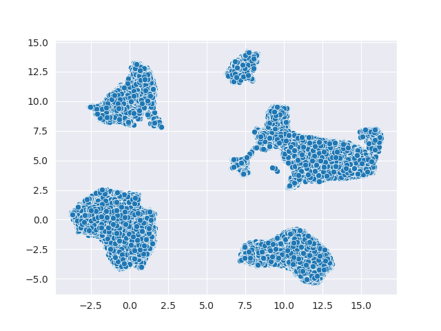
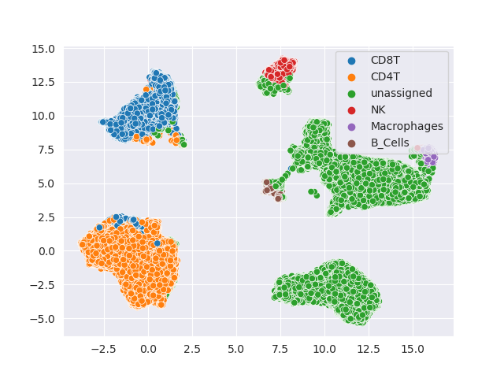

####################
Quickstart Guide
####################

You don't need to know every detail of every method to get CytofDR working. In fact, you don't even
need to know much Python. ``CytofDR`` is a flexible and extensible framework to allow you to perform
and benchmark dimension reduction all in one place with human readable codes. Here, there are examples
to walk you through every step of the way! Scroll to **Pipeline At a Glance** for **TLDR**.

-----------

****************
Loading Dataset
****************

The first step of the process is loading your CyTOF sample into Python. The ``CytofDR`` package uses the
``numpy`` framework extensively, which means that loading expression matrices are fairly easy. Here, we
assume that all your datasets have been preprocessed and only lineage channels are preserved. If you need
to preprocess your data, you can use our sister package `PyCytoData <https://github.com/kevin931/PyCytoData>`_.

Assume that you have a csv with the rows as cells and columns as features. Further, the first row is 
feature names, here is what you can do:

.. code-block:: python

    >>> import numpy as np
    >>> expression = np.loadtxt(fname="PATH_To_file", dtype=float, skiprows=1, delimiter=",")
    
Voila, you have an expression matrix in an array! You can view the array by simply calling it:

.. code-block:: python

    >>> expression
    array([[1.73462413, 2.44479204, 0.        , ..., 0.22536523, 1.02089248, 0.1500314 ],
           [0.56619612, 1.52259608, 0.        , ..., 0.31847633, 0.        , 0.        ],
           [0.54875404, 0.        , 0.        , ..., 0.17807296, 0.46455456, 3.55193468],
           ...,
           [0.1630427 , 0.32121831, 0.        , ..., 0.61940005, 0.        , 3.50253287],
           [0.30990439, 2.59020988, 0.11689489, ..., 0.94090453, 0.1383413 , 0.        ],
           [0.71138557, 1.72764796, 0.        , ..., 0.        , 0.        , 0.        ]])

.. note:: CytofDR does not support working with fcs files directly!
.. note:: For outputs, we will use the example of the Oejen cohort Sample U.

Using ``PyCytoData``
----------------------------

``PyCytoData`` is our sister package that specifically handles CyTOF data IO as well as preprocessing.
This allows us to have a consistent interface across multiple different packages, much like the
same engine but with different accessories. Here, we will should you how to load a dataset
with ``PyCytoData``:

.. code-block:: python

    >>> from PyCytoData import FileIO

    >>> dataset = FileIO.load_expression(files="/path", 
    ...                                  col_names=True,
    ...                                  delim="\t") 
    >>> dataset.expression_matrix
    array([[1.73462413, 2.44479204, 0.        , ..., 0.22536523, 1.02089248, 0.1500314 ],
           [0.56619612, 1.52259608, 0.        , ..., 0.31847633, 0.        , 0.        ],
           [0.54875404, 0.        , 0.        , ..., 0.17807296, 0.46455456, 3.55193468],
           ...,
           [0.1630427 , 0.32121831, 0.        , ..., 0.61940005, 0.        , 3.50253287],
           [0.30990439, 2.59020988, 0.11689489, ..., 0.94090453, 0.1383413 , 0.        ],
           [0.71138557, 1.72764796, 0.        , ..., 0.        , 0.        , 0.        ]])

Well, this look very similar to the ``numpy`` interface. Indeed, you can access the array
just as usual. You can extract the array if you wish, but you can also use this object as
we document in the `Working with PyCytoData <https://cytofdr.readthedocs.io/en/latest/tutorial/preprocessing.html>`_
section. In fact, ``PyCytoData`` is much more interesting than simply just a wrapper for the numpy method.

----------------------

*********************
Dimension Reduction
*********************

DR running DR is as easy as copy some code and hitting enter! Let's say you want to run UMAP, tSNE,
and PCA--three of the most popular methods. You can simply do the following:

.. code-block:: python

    >>> from CytofDR import dr
    >>> results = dr.run_dr_methods(expression, methods=["umap", "open_tsne", "pca"])

    Running PCA
    Runnign UMAP
    Running open_tsne
    ===> Finding 90 nearest neighbors using Annoy approximate search using euclidean distance...
    --> Time elapsed: 81.40 seconds
    ===> Calculating affinity matrix...
    --> Time elapsed: 2.84 seconds
    ===> Running optimization with exaggeration=12.00, lr=10243.67 for 250 iterations...
    Iteration   50, KL divergence 6.8745, 50 iterations in 2.1659 sec
    Iteration  100, KL divergence 6.3337, 50 iterations in 2.2041 sec
    Iteration  150, KL divergence 6.2017, 50 iterations in 2.3244 sec
    Iteration  200, KL divergence 6.1405, 50 iterations in 2.2421 sec
    Iteration  250, KL divergence 6.1041, 50 iterations in 2.2620 sec
    --> Time elapsed: 11.20 seconds
    ===> Running optimization with exaggeration=1.00, lr=10243.67 for 250 iterations...
    Iteration   50, KL divergence 4.8511, 50 iterations in 2.1616 sec
    Iteration  100, KL divergence 4.3954, 50 iterations in 2.1746 sec
    Iteration  150, KL divergence 4.1621, 50 iterations in 2.2973 sec
    Iteration  200, KL divergence 4.0129, 50 iterations in 2.5909 sec
    Iteration  250, KL divergence 3.9067, 50 iterations in 2.9614 sec
    --> Time elapsed: 12.19 seconds

We have some handy printouts to remind you what is running, but if you would like disable so that
it doesn't clutter your precious console screen, you can specify ``verbose=False``. 

Access Embeddings
----------------------

You can easily access the embeddings of that are stored in the object by accessing the ``reductions``
dictionary and use the method names as keys.

.. code-block:: python

    >>> results.reductions["UMAP"] 

    array([[-1.1084751 , 10.174761  ],
           [ 0.7808647 , -2.341636  ],
           [12.979893  , -5.1433287 ],
           ...,
           [11.690209  , -5.4123435 ],
           [ 0.9842613 , -2.8788142 ],
           [ 1.6086756 , -0.92493653]], dtype=float32)

To know the names of your embeddings, you can simply run:

.. code-block:: python

    >>> results.reductions.keys() 

    dict_keys(['PCA', 'UMAP', 'open_tsne'])

Plotting Results
-----------------

One of the main goals of DR is to visualize the data! Wanna know whether T cells are next to
B cells? We've got your back like your best friend! You can simply run the following:

.. code-block:: python

    results.plot_reduction("umap", save_path="PATH_To_FILE")

Here is an example of the embedding:

Umm, something is missing! There're no labels: it looks a bit dull! If you have labels or
cell types, you can do so by specifying the ``hue`` parameter: 

.. code-block:: python

    ## ``labels`` is a numpy array of labels
    results.plot_reduction("umap", save_path="PATH_To_FILE", hue=labels)

Here are the results of colored clusters:

Much better!

-----------------

*****************
DR Evaluation
*****************

Have you wondered which DR method is the best? Well, you can benchmark it yourself! This comes in two
steps! First, you will need to choose metrics and evaluate your DR methods! Then, you can rank your
methods according to these methods!

Currently, we do not support using custom methods for this framework. However, we have the following
categories of metrics:

- Global Structure Preservation ("global")
- Local Structure Preservation ("local")
- Downstream Performance ("downstream")
- Concordance ("concordance")

.. note:: The ``concordance`` category is more advanced! We will detail this more in the tutorial section.

Simple Evaluation with Auto Clustering
---------------------------------------------

For DR evaluation, we need clustering labels for both the original data and all the DR embeddings.
We offer a builtin pipeline with ``KMeans`` clustering for you to evaluate your dimension reduction
in one simple step!

.. code-block:: python

    >>> results.evaluate(category = ["global", "local", "downstream"], auto_cluster = True, n_clusters = 20)
    Evaluating global...
    Evaluating local...
    Evaluating downstream...

.. note::
    
    We do recommend you change ``n_clusters`` according your knowledge of your dataset. If you have a rough
    idea of the types of cells present, it is a good idea to use that to your advantage.

With this, you have obtained your first DR evaluation! To check the results, simply access the ``evaluations``
attribute, which is a dictionary:

.. code-block:: python

    >>> results.evaluations

    {'global': {'spearman': {'PCA': 0.5525689817179995, 'UMAP': 0.2008244633670485, 'open_tsne': 0.39277360696372215},
     'emd': {'PCA': 2.2033917947258224, 'UMAP': 3.112385214988549, 'open_tsne': 27.49076176658772}},
     'local': {'knn': {'PCA': 0.0005694575510071263, 'UMAP': 0.0023624353258924215, 'open_tsne': 0.0044678012430444825},
     'npe': {'PCA': 1488.405, 'UMAP': 997.0799999999999, 'open_tsne': 1180.4850000000001}},
     'downstream': {'cluster reconstruction: silhouette': {'PCA': 0.06870182580853562, 'UMAP': 0.30413094, 'open_tsne': 0.25822831903485394},
     'cluster reconstruction: DBI': {'PCA': 2.790046489762818, 'UMAP': 1.8574548809614353, 'open_tsne': 1.3668004451334124},
     'cluster reconstruction: CHI': {'PCA': 90455.42338884463, 'UMAP': 138076.51781759382, 'open_tsne': 68364.87227338477},
     'cluster reconstruction: RF': {'PCA': 0.5735979292493529, 'UMAP': 0.888894367065204, 'open_tsne': 0.8947121903118452},
     'cluster concordance: ARI': {'PCA': 0.36516898619341764, 'UMAP': 0.6103950568737259, 'open_tsne': 0.5267480266406396},
     'cluster concordance: NMI': {'PCA': 0.6099045072502076, 'UMAP': 0.7625670100165506, 'open_tsne': 0.7245013680103589},
     'cell type-clustering concordance: ARI': {}, 'cell type-clustering concordance: NMI': {}}}

This is a nested dictionary with the following levels:

1. Categories
2. Metrics/Sub-categories
3. Embedding Names

This can be a little confusing, but you can access the sub-levels individually:

.. code-block:: python

    >>> results.evaluations["global"]

    {'spearman': {'PCA': 0.5525689817179995, 'UMAP': 0.2008244633670485, 'open_tsne': 0.39277360696372215},
     'emd': {'PCA': 2.2033917947258224, 'UMAP': 3.112385214988549, 'open_tsne': 27.49076176658772}}

or you can look at individual metrics:

.. code-block:: python
    
    >>> results.evaluations["global"]["emd"]

    {'PCA': 2.2033917947258224, 'UMAP': 3.112385214988549, 'open_tsne': 27.49076176658772}

If you are so inclined, you can utilize these results directly. However, if you would like us to do the work for you,
read on!

.. note::
    
    Notice that there are no values for ``cell type-clustering concordance: ARI`` and ``cell type-clustering concordance: NMI``.
    This is because we don't have a builtin pipeline for cell typing. You must provide these information on your own, which is
    covered in the next section.

Use Your Own Labels
-------------------------

If you are a more advanced user, you may be aware that ``KMeans`` may not be the ideal solution for CyTOF.
You may wish to cluster using ``FlowSOM`` in R or your own custom toolchain. If you have these data, you
can easily add them to the object and them perform evaluations as usual:

.. code-block:: python

    >>> results.add_evaluation_metadata(original_labels = original_labels,
    ...                                 embedding_labels = embedding_labels)

These are the **bare-minimum** needed! Here, ``original_labels`` is a ``numpy`` array. On the other hand,
``embedding_labels`` is a dictionary with name of DR methods as keys and ``numpy`` arrays
of labels as the values. You can, of course, load these data using the methods demonstrated above!

However, if you also have cell types:

.. code-block:: python

    >>> results.add_evaluation_metadata(original_labels = original_labels,
    ...                                 original_cell_types = original_cell_types,
    ...                                 embedding_labels = embedding_labels,
    ...                                 embedding_cell_types = embedding_cell_types)

which will allow you to run **Cell Type-Clustering Concordace** metrics as part of the ``downstream`` category. Here,
``original_cell_types`` is just a ``numpy`` array, whereas ``embedding_cell_types`` is a dictionary.

Afterwards, you can run your DR evaluation as usual using the "Simple" method. All the downstream toolchains
remain the same, except that the ``auto_cluster`` and ``n_clusters`` parameters no longer play a role: 

.. code-block:: python

    >>> results.evaluate(category = ["global", "local", "downstream"])
    Evaluating global...
    Evaluating local...
    Evaluating downstream...

Rank DR Methods
-------------------

Now, you can finally rank your methods! This will be fairly easy:

.. code-block:: python

    >>> results.rank_dr_methods()

    {'PCA': 1.7083333333333333, 'UMAP': 2.25, 'open_tsne': 2.0416666666666665}

As you can see, this returns a dictonary with method names the methods as keys and their scores
as values. If you see decimals, don't panic! at your computer! We rank each metric
individually and the final results are appropriately weighted! Here, larger score is
better! Obviously, if you have read `our paper <https://doi.org/10.1101/2022.04.26.489549>`_,
you know that UMAP is pretty good at what it does when compared to PCA and tSNE! 

----------------

**********************
Pipeline At a Glance
**********************

Putting everything together, we will have a pipeline like this:

.. code-block:: python

    >>> from CytofDR import dr
    >>> results = dr.run_dr_methods(expression, methods=["umap", "open_tsne", "pca"])
    >>> results.evaluate(category = ["global", "local", "downstream"])
    >>> results.rank_dr_methods()

Or alternatively with your own clusters and cell types: 

.. code-block:: python

    >>> from CytofDR import dr
    >>> results = dr.run_dr_methods(expression, methods=["umap", "open_tsne", "pca"])
    >>> results.add_evaluation_metadata(original_labels = original_labels,
    ...                                 original_cell_types = original_cell_types,
    ...                                 embedding_labels = embedding_labels,
    ...                                 embedding_cell_types = embedding_cell_types)
    >>> results.evaluate(category = ["global", "local", "downstream"])
    >>> results.rank_dr_methods()

Congratulations! You've made it through the quickstart guide! Give yourself a high five
and start performing DR! For more detailed documentations, look around on this website!

**********************
What Next?
**********************

