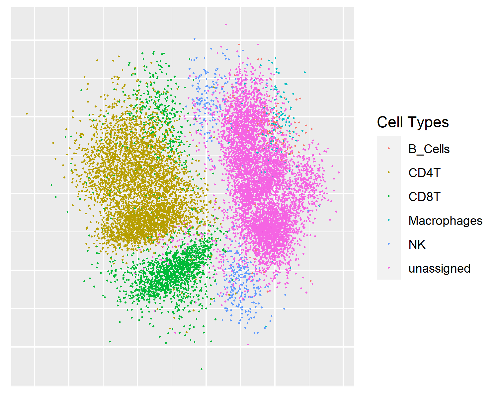

Choosing a DR Method
=====================

Since there are 16 unique methods with even more options right in this package,
you may ask the question of which one you should choose. The answer can be long 
or short. In `our paper <https://www.biorxiv.org/content/10.1101/2022.04.26.489549v1.abstract>`_,
we detailed the various performance aspects of these DR methods, and if you need
all the details, you should definitely head over there and give it a quick read.
This tutorial gives you some high-level recommendations and some heuristics for you
to follow.

-------------------------------------

********************************
What matters?
********************************

As our evaluation framework details, there are four major categories of
accuracy metrics in DR:

- Global Structure Preservation
- Local Structure Preservation
- Downstream Analysis Performance
- scRNA-seq Concordance

While the first three are universally applicable, the last speaks to
the increasing trend of integrative analysis. To read more about these
evaluation criteria, head to the `Evaluation Metrics <>`_ section for
details.

However, accuracy is not all. Since CyTOF has uniquely large sample size,
we want to ensure that each method is scalable and usable. Luckily, the
``CytofDR`` package ensures that all the methods are user-friendly (
except for a few methods that need some TLC to be installed). In this
tutorial, we will take everything into consideration and make recommendations
accordingly.

--------------------------------------

**********************************************
Characteristics of Common and Top DR Methods
**********************************************

Here, we detail the quirks and features of our top methods! Only those
that this package supports will be listed!

SAUCIE
--------

This is a surprise: the underdog that is so likeable! But to be rational,
it also has its faults! 

**Pro:**

- Great performance all around!
- Mindnumbingly fast on the level of linear methods
- No major faults in terms of accuracy

**Con:**

- Software is out-of-date and its future support is question
- It has some quirks and the usability suffers

MDS
----

This is a complicated one! It is so traditional, and yet it presents interesting
results!

**Pro:**

- Superb global performance.
- Great local performance.
- Raw accuracy in terms of structural preservation is unmatched.

**Con:**

- Dismal downstream capabilities
- Almost always need downsampling for CyTOF

UMAP
-----

This is the favorite among many, and it has earned its spot rightfully so.

**Pro:**

- Superb downstream performance.
- Awesome local performance.
- Great documentation.
- Fast and easy to use. 

**Con:**

- Global performance is not as impressive

tSNE
------

This is the old classic: it has a loyal following despite the emergence
of UMAP.

**Pro:**

- Great local performance.
- Decent downstream performance.
- openTSNE is relatively fast and quite easy to use.

**Con:**

- Global performance is rather poor
- No standout feature

PCA
-----

The linear champion! What more needs to be said?

**Pro:**

- Great global performance.
- Blazing fast
- Linear and interpretable

**Con:**

- Local and downstream are average at best
- No longer the gold standard

PHATE 
------

An interesting addition to other methods with a unique
focus on trajectory inference.

**Pro:**

- Great local and downstream performance.
- Embeddings uniquely resemble trajectories between clusters.

**Con:**

- Global performance is nowhere near claimed.
- Can be slow at times.

----------------------------------

*************************
What's your use case?
*************************

Combining all aspects of evaluation, it is very hard to come up with a
one-size-fits-all recommendation. Instead, we make recommendations
based on your use case! While ``CytofDR`` can be used in any setting, 
even for other data sources that are not CyTOF, it is good to think
about what your goals are and what is important for you. In this section,
we will list a few common use cases and how you can best meet these
goals.

Further, we oftentimes recommend a couple of methods instead of just one
because we strongly believe that investigating a few embeddings together
will allow you to see different perspectives. As you noticed above,
no one method is the best in everything. Thus, they will nicely complement
each other and help you succeed. 

Accuracy-Oriented Data Analysis
--------------------------------

This is perhaps the most rigorous usecase because accuracy is of paramount 
importance: for example, one may want to investigate the relatonship between
two cell types. In this case, we recommend that you prioritize accuracy
above anything else.

In this case, you should consider **MDS**, **SAUCIE**, and **UMAP**. These
three methods will allow you to explore both global and local performance
along with good cluster resolution offered by UMAP.

Rapid Prototyping
-------------------

Perhaps there is only one valid answer here: **UMAP**. This situation is quite
common: you have a dataset and all you care is to look at an embedding with
decent accuracy. UMAP is the undisputed champion to get this job done: it is
cross-platform, fast, and easy to use. We would have recommended SAUCIE, if it
were to be user-friendly, but its involved installation process and quirks
make it unsuitable for this purpose.

Production Pipeline
---------------------

This is a somewhat unique, but also important, usecase because oftentimes 
users want to ensure that their software pipeline is robust without worrying
much about issues. In this case, we can recommend four methods here: **UMAP**,
**open_tsne**, and **PCA**. All their packages are robust and quite
well supported. Further, they're quite scalable without needing to specifically
trying to tackle the sample size issue. If you use these methods in your
pipeline, you can feel at ease!

Downstream Analyses
--------------------

This is closely related to the first use case, but here, we would like to highlight
the clustering advantages offered by **UMAP**. Also, **PHATE** is a good option
if you're interested in investigating differentiation paths and trajectory
inference. If you wish, add **SAUCIE** to your arsenal for its global structure
preservation by compromizing a little on downstream performance, but you can
always use it in conjunction with **UMAP** to get the best of both worlds.

I Still Can't Choose! Help!
----------------------------

Well, I feel your pain! Truly, I always get too sentimental when deciding to part
with certain things and choose others. In this case, just go with **SAUCIE** and
**UMAP**. They are fast and will have you covered for most situations! This approach
will allow you to get started and decide later if a specific need or vision arises later.